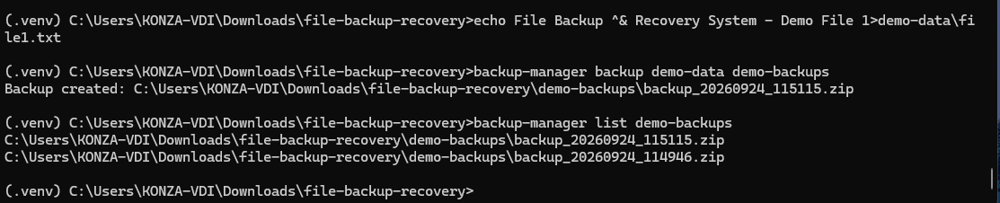

# File Backup & Recovery System

A secure, cross-platform Python command-line application for creating, restoring, verifying, listing, and safely deleting file backups.

The system uses ZIP archives, SHA-256 file hashing, backup manifests, archive integrity checks, secure path validation, structured logging, automated testing, and Python package installation to provide a practical local backup and recovery workflow.

## Features

* Create timestamped ZIP backups
* Generate a verification manifest for every backup
* Record SHA-256 hashes and file sizes
* Verify ZIP archive integrity using CRC checks
* Verify backed-up files using SHA-256 hashes
* Detect modified or missing backup files
* Restore files from verified backup archives
* Restore through a temporary staging directory to reduce partial-restore risk
* Protect restoration against ZIP path traversal
* List available backup archives
* Safely delete backups with confirmation
* Support automated deletion with `--yes`
* Record application activity and failures through logging
* Handle invalid and corrupted backup archives gracefully
* Cross-platform support for Windows, Linux, and macOS
* Automated testing with pytest
* Installable Python package using `pyproject.toml`
* Command-line entry point through `backup-manager`
* Uses the Python Standard Library for runtime functionality
* No database, cloud service, or internet connection required

## Technology Stack

| Technology   | Purpose                                    |
| ------------ | ------------------------------------------ |
| Python 3.11+ | Application development                    |
| `pathlib`    | Cross-platform file and directory handling |
| `zipfile`    | Backup archive creation and extraction     |
| `hashlib`    | SHA-256 integrity hashing                  |
| `json`       | Backup manifest management                 |
| `logging`    | Application activity and error logging     |
| `argparse`   | Command-line interface                     |
| `tempfile`   | Safe restore staging                       |
| `shutil`     | Finalized file restoration                 |
| `pytest`     | Automated testing                          |
| `setuptools` | Python package building and installation   |
| Git          | Version control                            |
| GitHub       | Source-code hosting                        |

## Project Screenshot

The screenshot below demonstrates the File Backup & Recovery System operating through its command-line interface.



## Project Structure

```text
file-backup-recovery/
├── docs/
│   └── images/
│       └── file-backup-recovery.png
│
├── src/
│   └── backup_manager/
│       ├── services/
│       │   ├── __init__.py
│       │   ├── backup.py
│       │   ├── restore.py
│       │   └── verification.py
│       │
│       ├── utils/
│       │   ├── __init__.py
│       │   ├── hashing.py
│       │   └── logging_config.py
│       │
│       ├── __init__.py
│       ├── config.py
│       └── main.py
│
├── tests/
│   ├── test_backup.py
│   ├── test_hashing.py
│   ├── test_restore.py
│   └── test_verification.py
│
├── .gitignore
├── LICENSE
├── README.md
├── pyproject.toml
└── requirements.txt
```

## Installation

### Prerequisites

* Python 3.11 or newer
* Git

The application runtime uses Python's standard library and does not require an external database, cloud service, or internet connection.

### 1. Clone the Repository

```bash
git clone https://github.com/bwachira649/file-backup-recovery.git
cd file-backup-recovery
```

### 2. Create a Virtual Environment

#### Windows

```powershell
python -m venv .venv
.venv\Scripts\activate
```

#### Linux

```bash
python3 -m venv .venv
source .venv/bin/activate
```

#### macOS

```bash
python3 -m venv .venv
source .venv/bin/activate
```

### 3. Install the Application

```bash
python -m pip install -e .
```

This installs the project as an editable Python package and registers the `backup-manager` command-line entry point.

### 4. Install Development Dependencies

```bash
python -m pip install -r requirements.txt
```

## Usage

The application provides commands for managing the complete local backup lifecycle.

### Create a Backup

```bash
backup-manager backup SOURCE_DIRECTORY BACKUP_DIRECTORY
```

Example:

```bash
backup-manager backup test-data backups
```

The application creates a timestamped ZIP archive containing the source files and a `backup_manifest.json` file.

The same operation can also be executed with:

```bash
python -m backup_manager.main backup test-data backups
```

### List Backups

```bash
backup-manager list backups
```

Backups are displayed with the newest archives listed first.

### Verify a Backup

```bash
backup-manager verify backups/backup_YYYYMMDD_HHMMSS.zip
```

Verification checks:

1. ZIP archive integrity
2. Backup manifest availability
3. Manifest validity
4. Backed-up file existence
5. File size
6. SHA-256 file hashes

A successful verification reports the number of files checked.

Example:

```text
Backup verified successfully. Files checked: 2
```

### Restore a Backup

```bash
backup-manager restore BACKUP_ZIP RESTORE_DIRECTORY
```

Example:

```bash
backup-manager restore backups/backup_YYYYMMDD_HHMMSS.zip restored
```

The restore process:

1. Validates the backup archive.
2. Checks ZIP integrity before extraction.
3. Validates archive paths against path traversal.
4. Extracts files into a temporary staging directory.
5. Copies successfully extracted files to the selected restore directory.

This staging approach reduces the risk of leaving a partially restored destination when an archive cannot be processed successfully.

### Delete a Backup

The application requires confirmation before deleting a backup:

```bash
backup-manager delete backups/backup_YYYYMMDD_HHMMSS.zip
```

The deletion can be cancelled by providing anything other than `yes`.

For controlled automation:

```bash
backup-manager delete backups/backup_YYYYMMDD_HHMMSS.zip --yes
```

## Backup Integrity

Every backup contains a `backup_manifest.json` file.

The manifest records:

* Application name
* Application version
* Backup creation timestamp
* Hashing algorithm
* Source directory name
* Number of backed-up files
* Relative file paths
* File sizes
* SHA-256 hashes

This provides a verifiable record of the expected contents of the backup.

The verification process combines ZIP-level integrity checks with application-level SHA-256 verification.

This allows the system to detect:

* Corrupted ZIP archives
* Missing manifest files
* Invalid manifest data
* Missing files
* Modified file contents
* File-size mismatches

## Security

### Path Traversal Protection

The restoration process validates every archive path before writing it to disk.

This prevents malicious ZIP entries from escaping the selected restoration directory through paths such as:

```text
../../outside.txt
```

Only paths contained within the selected restoration location are accepted.

### Corrupted Archive Handling

Invalid or corrupted ZIP archives are rejected without exposing an unhandled Python traceback to the user.

### Safe Restoration

Files are first extracted into a temporary staging directory. Files are copied to the final destination only after the archive has been successfully processed.

Additional security information can be documented in:

```text
docs/SECURITY.md
```

## Logging

Application activity is recorded in:

```text
logs/backup_manager.log
```

The log records important events such as:

* Backup creation
* Backup restoration
* Backup deletion
* Invalid or corrupted backup attempts
* Operation failures

The `logs/` directory is excluded from Git using `.gitignore`.

## Testing

The project uses `pytest` for automated testing.

Run the complete test suite:

```bash
python -m pytest
```

The current automated test suite covers:

* SHA-256 file hashing
* Backup creation
* Backup listing
* Backup restoration
* ZIP path traversal protection
* Valid backup verification
* Detection of modified backup content

Current Windows test result:

```text
7 passed
```

Manual testing has additionally covered:

* Missing source directories
* Missing backup archives
* Invalid ZIP files
* Corrupted ZIP archives
* Missing manifests
* Malformed manifests
* Invalid CLI arguments
* Invalid CLI commands
* Safe deletion confirmation
* Automated deletion with `--yes`
* Successful end-to-end backup and restoration
* Byte-for-byte comparison of restored files

## Development

The project follows a modern Python `src/` package layout:

```text
src/
└── backup_manager/
```

The application is configured through `pyproject.toml` and can be installed with:

```bash
python -m pip install -e .
```

The installed command is:

```bash
backup-manager
```

Runtime functionality uses Python's Standard Library.

Development and automated testing use `pytest`.

## Practical Skills Demonstrated

This project demonstrates practical experience in:

* Python application architecture
* Python package development
* `src/` layout project organization
* Command-line application design
* CLI argument validation
* File and directory management
* ZIP archive creation and extraction
* SHA-256 hashing
* Data integrity verification
* JSON manifest generation and validation
* Temporary staging and safe file restoration
* ZIP path traversal prevention
* Exception handling and user-facing error reporting
* Structured application logging
* Automated testing with pytest
* Negative and failure-case testing
* Virtual environment management
* Python package installation
* Cross-platform Python development
* Git version control
* GitHub repository management

## Limitations

This project is designed as a local backup and recovery utility.

It does not currently provide:

* Cloud storage
* Remote backup servers
* Backup encryption
* Scheduled background backups
* Incremental or differential backups
* Backup compression configuration
* Multi-user access control
* Remote monitoring

These capabilities could be considered for future versions.

## License

This project is licensed under the MIT License.

See the `LICENSE` file for details.

## Author

**Brian Wachira**

GitHub:

https://github.com/bwachira649
